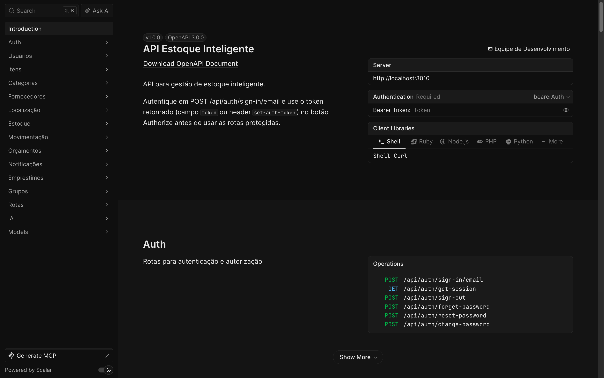
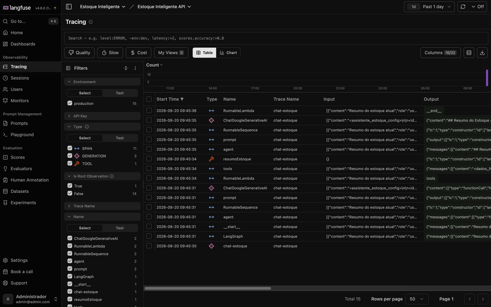
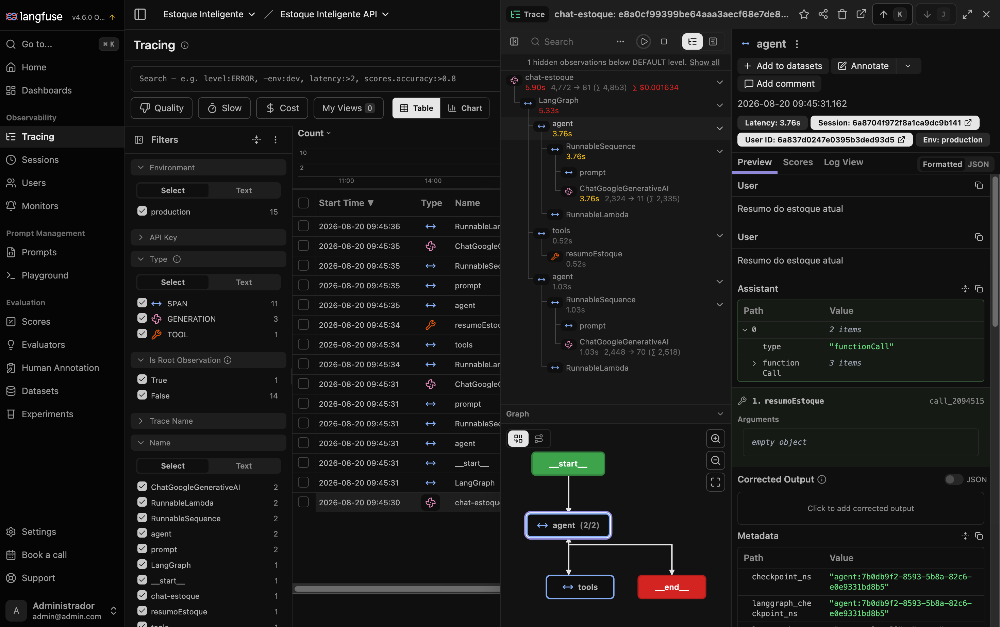

# Estoque Inteligente API

Back-end de um sistema de gestão de estoque desenvolvido como Trabalho de Conclusão de Curso, com um assistente de IA embutido que consulta os dados reais do inventário para responder perguntas em linguagem natural.

         

## Índice

- [Sobre o projeto](#sobre-o-projeto)
- [Capturas de tela](#capturas-de-tela)
- [Funcionalidades](#funcionalidades)
- [Assistente de IA](#assistente-de-ia)
- [Observabilidade com Langfuse](#observabilidade-com-langfuse)
- [Instalação](#instalação)
- [Configuração](#configuração)
- [Executando o projeto](#executando-o-projeto)
- [Docker](#docker)
- [Estrutura do projeto](#estrutura-do-projeto)
- [Endpoints da API](#endpoints-da-api)
- [Testes](#testes)
- [Documentação](#documentação)
- [Troubleshooting](#troubleshooting)
- [Licença](#licença)

## Sobre o projeto

O Estoque Inteligente é um sistema de controle de inventário voltado para organizações de pequeno/médio porte. Cobre o ciclo completo: cadastro de itens, movimentações de entrada e saída, empréstimos com controle de atraso, orçamentos de compra, alertas de estoque mínimo e relatórios.

O sistema inclui um chat com IA embutido, que responde perguntas sobre o próprio estoque ("quais itens estão abaixo do mínimo?", "o que priorizar na próxima compra?") consultando os dados reais via ferramentas MCP, com observabilidade de custo e desempenho via Langfuse.

O front-end (Next.js) vive em [`estoque-inteligente-front`](../estoque-inteligente-front) e consome esta API via HTTP, com autenticação de sessão compartilhada.

Repositórios do projeto no grupo GitLab [`estoque-inteligente`](https://gitlab.com/estoque-inteligente): [API](https://gitlab.com/estoque-inteligente/estoque-inteligente-api) e [front](https://gitlab.com/estoque-inteligente/estoque-inteligente-front).

## Capturas de tela

**Documentação interativa (Scalar)**


**Dashboard de custo e uso no Langfuse**


**Trace de uma conversa do assistente**


## Funcionalidades

- **Usuários e permissões**: cadastro, autenticação por sessão (Better Auth) e RBAC próprio por grupo e rota
- **Itens**: CRUD completo, com categoria, localização e fornecedor associados
- **Estoque**: quantidades, mínimo configurável por item e alertas automáticos quando o saldo cai abaixo do limite
- **Movimentações**: histórico de entradas e saídas, base para os relatórios e para as ferramentas de análise da IA
- **Empréstimos**: controle de itens emprestados, devolução e um job automático que sinaliza empréstimos atrasados
- **Orçamentos**: montagem de pedidos de compra com múltiplos itens
- **Fornecedores e localizações**: cadastros de apoio usados em filtros e relatórios
- **Notificações**: alertas gerados pelo sistema (estoque mínimo, empréstimo atrasado) e lidos pelo usuário
- **Assistente de IA**: chat com histórico persistido por conversa, respostas em streaming e acesso somente leitura aos dados acima (detalhado na seção seguinte)

## Assistente de IA

O assistente vive no módulo `src/modules/ia/` e no servidor MCP em `src/libs/mcp/`. A arquitetura resumida:

```
Usuário (chat no front)
   │  POST /ia/conversas/:id/mensagens
   ▼
IAController → IAService
   │  cria um agente ReAct (LangGraph) com Gemini como LLM
   ▼
Agente consulta ferramentas via MCP ──► GET/POST /mcp (mesma API, mesma sessão)
   │                                        │
   │                                        ▼
   │                              11 tools somente leitura
   │                              (buscarItens, resumoEstoque,
   │                               itensPrioritariosCompra, ...)
   ▼
Resposta em streaming (SSE) ──► front-end renderiza token a token
   │
   └─► Langfuse (trace, custo, latência) + coleção ia_usos no Mongo
```

### Agente e ferramentas

O agente é construído com `createReactAgent` (LangGraph): a cada passo ele decide se responde diretamente ou chama uma ferramenta, observa o resultado e decide o próximo passo, dentro de um limite de passos (`IA_RECURSION_LIMIT`). As ferramentas em `src/libs/mcp/tools/` são todas de leitura, uma por arquivo:

`buscarCategorias`, `buscarEmprestimos`, `buscarEstoque`, `buscarFornecedores`, `buscarItens`, `buscarLocalizacoes`, `buscarMovimentacoes`, `buscarOrcamentos`, `resumoEstoque`, `verificarItensAbaixoMinimo` e `itensPrioritariosCompra` (cruza déficit de estoque com frequência de saída nos últimos 30 dias para ranquear prioridade de compra).

O servidor MCP é a própria API: exige a mesma sessão Better Auth de qualquer outra rota (`getAuth().api.getSession`), não é um endpoint aberto. O `IAService` conecta nele via `MultiServerMCPClient` repassando o cookie de sessão do usuário que está conversando, então cada ferramenta chamada pelo modelo respeita o RBAC do usuário real.

### Prompt e defesa contra prompt injection

O system prompt (`IAService.ts`) restringe o assistente ao domínio de estoque e trata qualquer conteúdo vindo de ferramentas MCP como dado, nunca como instrução. Há um conjunto de "canários" de vazamento (`contemVazamentoDoPrompt`): se a resposta do modelo contiver trechos do próprio prompt de sistema, isso indica que uma tentativa de extração funcionou parcialmente, e o caso pode ser sinalizado em observabilidade. Regras de formatação (Markdown, tabelas para listas) e de concisão (sem parágrafos de abertura/fechamento) mantêm a resposta objetiva.

### Streaming e limites operacionais

- **Streaming real**: `agent.streamEvents` (API v2 do LangGraph) alimenta um `AsyncGenerator` consumido como Server-Sent Events pelo front, com o cliente MCP fechado no `finally` independente de sucesso, erro ou cancelamento.
- **Janela de contexto com resumo rolante**: as últimas 15 mensagens (`JANELA_CONTEXTO`) são enviadas na íntegra a cada turno; mensagens mais antigas são condensadas incrementalmente num resumo (`resumo`/`resumoAteIndice` em `ConversaModel`, gerado por uma chamada de LLM dedicada e mais barata) e injetado no system prompt, em vez de simplesmente descartadas.
- **Concorrência por usuário**: no máximo `IA_MAX_STREAMS_SIMULTANEOS` (padrão 2) streams simultâneos por usuário, controlado em memória (`IALimites.ts`).
- **Rate limit HTTP**: 15 mensagens/minuto e 60 requisições/minuto (CRUD de conversas) por usuário, via `express-rate-limit`.
- **Teto de custo por chamada**: `IA_MAX_OUTPUT_TOKENS` (1536) e um orçamento fixo de "thinking" (`IA_THINKING_BUDGET`), já que o modelo usado rejeita desativar o thinking budget e um valor dinâmico custaria mais por resposta.
- **Timeout**: `IA_TIMEOUT_MS` encerra uma resposta que trava.

### Custo e uso

Cada resposta do agente é registrada em duas frentes, de propósito diferente:

1. **`ia_usos` (MongoDB)**: uma linha por mensagem, com tokens de entrada/saída/pensamento/cache, custo estimado em USD (calculado localmente a partir de uma tabela de preço por modelo em `IAConfig.ts`), quantidade de ferramentas chamadas, duração e motivo de encerramento (`concluido`, `erro`, `cancelado`, `tempo_esgotado`, `limite_passos`). É a fonte usada para relatórios internos de uso por usuário.
2. **Langfuse**: trace completo por mensagem, com o mesmo custo recalculado a partir da própria tabela de preços do projeto (os preços nativos do Langfuse para o modelo são suprimidos no boot, via `suprimirPrecosNativosDoLangfuse`, evitando contar o custo em dobro).

## Observabilidade com Langfuse

[Langfuse](https://langfuse.com) é uma plataforma open source de observabilidade para aplicações com LLM, com licença MIT e opção de self-hosting completo. No projeto ela roda via `docker compose --profile langfuse up -d` (`npm run langfuse:up`), com sua própria stack: Postgres para metadados, ClickHouse para os traces em escala, Redis para filas e o MinIO já usado pela API como armazenamento de eventos e mídia. É opcional por completo: se `LANGFUSE_PUBLIC_KEY`/`LANGFUSE_SECRET_KEY` estiverem vazios, o `CallbackHandler` nem é criado e a API funciona normalmente, só sem emitir traces.

O que ela adiciona sobre o registro próprio em `ia_usos`:

- **Trace por conversa**: cada troca de mensagem vira um trace agrupado por `sessionId` (a conversa) e `userId`, com todos os passos do agente dentro (raciocínio, cada chamada de ferramenta MCP, o retorno de cada uma, a geração final).
- **Latência por etapa**: quanto tempo cada chamada ao modelo e cada tool call levaram, não só o tempo total da resposta.
- **Custo automático**: cálculo de custo por geração a partir de tokens de entrada, saída, cache e "thinking", com dashboards de tendência por modelo, usuário ou período.
- **Depuração de prompt**: o conteúdo exato enviado ao modelo em cada passo fica visível, incluindo o resultado bruto de cada ferramenta MCP, o que facilita depurar por que o agente tomou uma decisão específica.
- **Base para alertas e avaliação**: a mesma infraestrutura de trace serve de base para alertas (ex.: taxa de respostas fora do escopo) e para avaliação sistemática de qualidade, ainda não implementada neste projeto.

Localmente, a UI fica em `http://localhost:3002`, exposta só em loopback por padrão.

## Instalação

### Pré-requisitos

- Node.js 20 ou superior
- MongoDB (local ou Atlas)
- Docker (opcional, recomendado para MinIO e Langfuse)
- Git

```bash
git clone https://gitlab.com/estoque-inteligente/estoque-inteligente-api.git
cd estoque-inteligente-api
npm install
cp .env.example .env
```

## Configuração

Todas as variáveis estão documentadas com exemplos e comentários em [`.env.example`](.env.example). Os grupos principais:

- **API**: porta, ambiente, logs
- **Banco de dados**: `DB_URL` (MongoDB)
- **RBAC**: domínio usado para casar rota x grupo
- **Better Auth**: secret de sessão, URL base, OAuth Google
- **E-mail**: credenciais SMTP/Gmail para recuperação de senha e notificações
- **MinIO / S3**: endpoint, credenciais e buckets de armazenamento de arquivos
- **IA**: `GEMINI_API_KEY`, modelo (`GEMINI_MODEL`), tetos de token e de tempo, limite de concorrência
- **Langfuse**: chaves, portas e segredos da stack de observabilidade (todos opcionais)

Para ligar a IA, o mínimo necessário é `GEMINI_API_KEY` (gerar em [aistudio.google.com/apikey](https://aistudio.google.com/apikey)). Langfuse é um passo à parte, descrito abaixo.

### Ativando o Langfuse

```bash
# 1. Preencha LANGFUSE_PUBLIC_KEY, LANGFUSE_SECRET_KEY e os segredos de infra no .env
# 2. Suba a stack (Postgres + ClickHouse + Redis + web)
npm run langfuse:up

# UI em http://localhost:3002

# Para desligar
npm run langfuse:down
```

## Executando o projeto

```bash
npm run dev      # desenvolvimento, com hot reload (tsx watch)
npm start        # produção, sem watch
npm run seed     # popula o MongoDB com dados fake (usuários, itens, categorias...)
```

## Docker

```bash
docker compose up --build              # API + MongoDB + MinIO
docker compose up -d --build           # mesmo, em background
docker compose --profile langfuse up -d   # adiciona a stack de observabilidade
docker compose down                    # para os containers
docker compose down -v                 # para e apaga os volumes (dados)
```

## Estrutura do projeto

Cada módulo de domínio segue o mesmo padrão em camadas: model, schema de validação, filtro de query, repositório, serviço, controller, rotas e documentação OpenAPI.

```
estoque-inteligente-api/
├── src/
│   ├── app.ts                        # configuração do Express
│   ├── config/                       # conexão Mongo, Better Auth, MinIO...
│   ├── middlewares/                  # AuthMiddleware, AuthPermission, LogRoutesMiddleware
│   ├── modules/
│   │   ├── usuario/, categoria/, localizacao/, item/, estoque/,
│   │   │   fornecedor/, movimentacao/, notificacao/, orcamento/,
│   │   │   emprestimo/, grupo/, rota/       # CRUD por domínio, mesmo padrão de arquivos
│   │   └── ia/
│   │       ├── IAService.ts          # agente ReAct, system prompt, streaming
│   │       ├── IAConfig.ts           # modelo, tetos de token, tabela de preço
│   │       ├── IALimites.ts          # limite de streams simultâneos por usuário
│   │       ├── IAObservabilidade.ts  # integração Langfuse (callbacks, trace, custo)
│   │       ├── IAUsoModel.ts / IAUsoService.ts   # registro próprio de uso e custo
│   │       ├── ConversaModel.ts      # histórico de conversas
│   │       └── IAController.ts / iaRoutes.ts / iaDocs.ts
│   ├── libs/mcp/
│   │   ├── MCPServerFactory.ts       # monta o servidor MCP
│   │   ├── mcpRoutes.ts              # expõe o servidor em /mcp, autenticado
│   │   └── tools/                    # uma ferramenta por arquivo, somente leitura
│   └── utils/                        # CommonResponse, CustomError, logger, OpenAPI registry
├── test/                             # setup/teardown dos testes de rotas
├── docker-compose.yml                # API, MongoDB, MinIO e (profile) Langfuse
├── Dockerfile
└── server.ts                         # entrypoint
```

## Endpoints da API

### Autenticação

Sessão por cookie via [Better Auth](https://better-auth.com), montada em `/api/auth/*` (login e-mail/senha, OAuth Google). Rotas protegidas exigem sessão válida (`AuthMiddleware`) e permissão liberada para o grupo do usuário (`AuthPermission`, RBAC descrito no módulo `rota`).

### CRUD por domínio

Usuários, itens, categorias, fornecedores, localizações, movimentações, orçamentos e notificações seguem o mesmo padrão REST:

```
GET    /<recurso>        # lista, paginado e filtrável
GET    /<recurso>/:id    # busca por id
POST   /<recurso>        # cria
PUT    /<recurso>/:id    # atualiza
DELETE /<recurso>/:id    # remove
```

### Assistente de IA (`/ia`)

```
POST   /ia/conversas                  # cria uma conversa (opcionalmente com mensagem inicial)
GET    /ia/conversas                  # lista as conversas do usuário autenticado
GET    /ia/conversas/:id              # detalhe de uma conversa, com histórico
DELETE /ia/conversas/:id              # remove a conversa
POST   /ia/conversas/:id/mensagens    # envia uma mensagem, resposta em streaming (SSE)
```

### MCP (`/mcp`)

Endpoint interno consumido pelo próprio `IAService`. Exige a mesma sessão Better Auth do resto da API.

> **Documentação completa**: acesse `/docs` com o servidor rodando para a referência OpenAPI completa (Scalar), gerada a partir dos mesmos schemas Zod usados na validação.

## Testes

```bash
npm test                                              # jest --coverage, todos os testes
npx jest src/modules/item/__tests__/ItemModel.test.ts # um arquivo específico
npx jest -t "nome do teste"                           # por nome
```

## Troubleshooting

**API sobe mas toda rota nova dá 403/404 mesmo com o código certo.** Rota protegida sem registro correspondente na coleção `rota` (RBAC) nega por padrão. Toda rota nova precisa de um `Rota` (seed ou via `/rotas`) com o domínio e as flags de método certas.

**`DB_URL` configurado e mesmo assim a API não conecta no Mongo.** Confira se o Mongo está de pé (`docker compose up -d` sobe junto) e se a string bate com o ambiente: `mongodb://localhost:27017/...` local vs. o nome do serviço Docker vs. a connection string do Atlas.

**Chat de IA responde só "Não foi possível obter os dados no momento."** Normalmente é `GEMINI_API_KEY` ausente ou inválida. Segundo suspeito: o servidor MCP (`/mcp`) exige sessão Better Auth válida, então um cookie expirado no meio da conversa também derruba a resposta.

**Langfuse não mostra nenhum trace novo.** `LANGFUSE_PUBLIC_KEY`/`LANGFUSE_SECRET_KEY` vazios fazem o `CallbackHandler` nem ser criado (comportamento esperado, sem Langfuse ligado). Se as chaves estão preenchidas e ainda assim nada aparece, confira se `npm run langfuse:up` está de pé e se `LANGFUSE_BASE_URL` aponta pro serviço certo.

## Licença

[](LICENSE)
